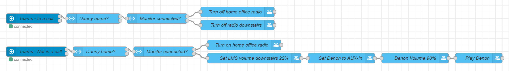

# Introduction
This script is monitoring connected monitors to my laptop. It makes use of one sensor that is created in Home Assistant up front. 

The use case for this script is to monitor if my laptop is connected to the external monitor in my home office, and to mute the radio automatically when I'm joining an online meeting in the home office or downstairs in the kitchen, depending on where I'm working in the house. This is currently automated as follows:


# Important
This solution is created to work with Home Assistant. It will work with any home automation platform that provides an API, but you probably need to change the PowerShell code.

# Requirements
* Create a input_boolean switch via `https://<HA URL>/config/helpers` and make sure it's named as `input_boolean.homeoffice_monitor`
* Generate a Long-lived access token via `https://<HA URL>/profile/security` ([see HA documentation](https://developers.home-assistant.io/docs/auth_api/#long-lived-access-token))
* Copy and temporarily save the token somewhere you can find it later
* Download the files from this repository and save them to `C:\Scripts\Get-MonitorStatus`
* Connect your home office external monitor if you haven't done so already
* Run the script with the run once switch: `Get-MonitorStatus.ps1 -RunOnce`
* Edit the Settings.ps1 file and:
  * Replace `<Insert token>` with the token you generated
  * Replace `<HA URL>` with the URL to your Home Assistant server
  * Add the serial numbers of the current connected monitors accordingly
* Save the Settings.ps1 file
* Start a elevated PowerShell prompt, browse to the folder you have stored the scripts, and run the following command:
```powershell
Set-ExecutionPolicy -ExecutionPolicy RemoteSigned -ErrorAction SilentlyContinue
Unblock-File .\Settings.ps1
Unblock-File .\Get-MonitorStatus.ps1
Start-Process -FilePath .\nssm.exe -ArgumentList 'install "External Monitor Status monitoring" "C:\Windows\System32\WindowsPowerShell\v1.0\powershell.exe" "-command "& { . C:\Scripts\Get-MonitorStatus\Get-MonitorStatus.ps1 }"" ' -NoNewWindow -Wait
Start-Service -Name "External Monitor Status monitoring"
```

After completing the steps below, confirm if the status and activity is updated as expected.